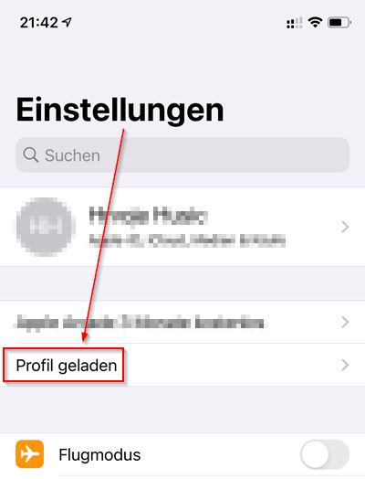

# ios-dns-mobileconfig

Configuration and Scripts for encrypted DNS configuration with iOS devices

Die mobileconfig Profile für DNS-Einstellungen werden von Lets Encrypt unterschrieben und können dann den Usern per einfachen Download zur Verfügung gestellt werden.

## Installation der Konfigurations-Scripte

* Installation von `lego`
* `cron.d/mobileconfig` anpassen und in nach `/etc/cron.d` kopieren
* `mobileconfig.sh` anpassen und in den gleichen Ordner kopieren wie die beiden Ordner `unsigned` mit den profilen und dem leeren `signed` Ordner.

## Installation der Profile auf dem iOS Gerät

Zunächst entscheidet man sich ob man seinem Gerät lieber DoT oder DoH beibringen mag.

Dann wird das passende Profil runtergeladen, z.B.:

* [Freifunk FFMUC DoT](https://husic.net/dns-config/dot-ffmuc.mobileconfig)
* [Freifunk FFMUC DoH](https://husic.net/dns-config/doh-ffmuc.mobileconfig)

Im Popup bestätigt ihr dass ihr das Profil laden wollt:

iOS bestätigt nun, dass das Profil geladen wurde und ihr es in den Einstellungen aktivieren könnt:

Geht nun zu den Einstellungen, dort wird das Profil direkt unter eurem iCloud account angezeigt. Clickt auf "Profil geladen":

Überprüft dass ihr das richtige Profil installiert, und dass es mit einem grünen Häkchen versehen ist. Dann bestätigt die Installation des Profils:

